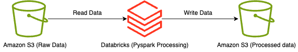
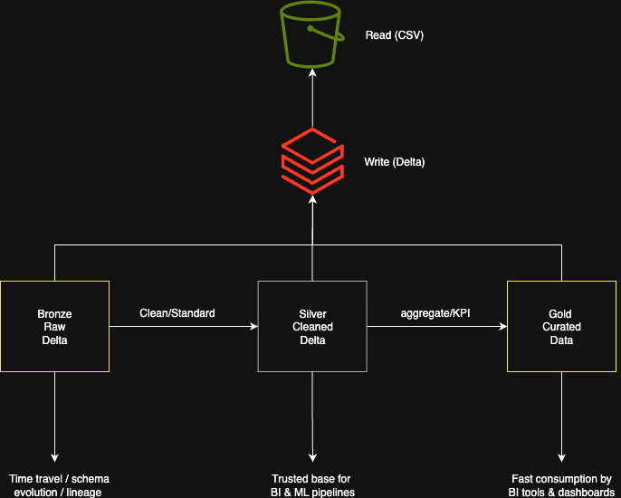

# Databricks S3 Pipeline

A simple PySpark project demonstrating how to read data from **Amazon S3** using Databricks, perform basic transformations, and write the processed data back to S3. This project serves as a starting point for building cloud-based ETL pipelines with Spark.
## 📊 Architecture

### Databricks S3 Pipeline

The diagram illustrates the flow of data in the Databricks S3 Pipeline:

- **Amazon S3 (Raw Data)**: The pipeline begins with raw data stored in Amazon S3.
- **Databricks (PySpark Processing)**: Data is read from S3 into Databricks, where it undergoes processing using PySpark.
- **Amazon S3 (Processed Data)**: The processed data is then written back to Amazon S3, ready for further analysis or use.

This setup enables efficient data processing and storage, leveraging the scalability of both Databricks and Amazon S3.

### Medallion Architecture

The Medallion Architecture diagram shows the organization of data into three layers:

- **Bronze (Raw Delta)**: This layer contains raw data in its original format, allowing for time travel and schema evolution.
- **Silver (Cleaned Delta)**: Data is cleaned and standardized in this layer, providing a trusted base for BI and ML pipelines.
- **Gold (Curated Data)**: The final layer where data is aggregated and optimized for fast consumption by BI tools and dashboards.

By structuring data in this way, the Medallion Architecture ensures data quality and accessibility, facilitating efficient data-driven decision-making.

## 📬 Contact Me

- **Email**: [vamseekrishna9201@gmail.com](mailto:vamseekrishna9201@gmail.com)  
- **LinkedIn**: [Vamsee Krishna Kotha](https://www.linkedin.com/in/vamseekrishnakotha/)

## 🔒 Managing Secrets

For secure management of credentials and sensitive information, Databricks provides a feature called [Secrets](https://docs.databricks.com/aws/en/security/secrets/). This allows you to store and reference sensitive data without exposing it in your notebooks or jobs.

To learn more about setting up and using secrets, visit the [Databricks Secrets Documentation](https://docs.databricks.com/aws/en/security/secrets/).

## 📂 Code File

The main code file for this project is `pyspark-testing.ipynb`, which contains the PySpark code for processing data in the Databricks environment. This notebook demonstrates how to read data from S3, perform transformations, and write the processed data back to S3.

